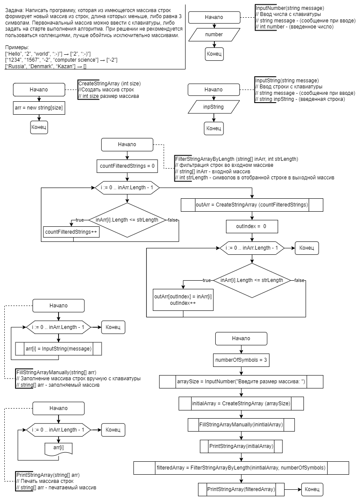

## **Данная работа необходима для проверки ваших знаний и навыков по итогу прохождения первого блока обучения на программе Разработчик. Мы должны убедится, что базовое знакомство с IT прошло успешно.**

### ***Задача алгоритмически не самая сложная, однако для полноценного выполнения проверочной работы необходимо:***

1. Создать репозиторий на GitHub
2. Нарисовать блок-схему алгоритма (можно обойтись блок-схемой основной содержательной части, если вы выделяете её в отдельный метод)
3. Снабдить репозиторий оформленным текстовым описанием решения (файл README.md)
4. Написать программу, решающую поставленную задачу
5. Использовать контроль версий в работе над этим небольшим проектом (не должно быть так, что всё залито одним коммитом, как минимум этапы 2, 3, и 4 должны быть расположены в разных коммитах)

*Задача: Написать программу, которая из имеющегося массива строк формирует новый массив из строк, длина которых меньше, либо равна 3 символам. Первоначальный массив можно ввести с клавиатуры, либо задать на старте выполнения алгоритма. При решении не рекомендуется пользоваться коллекциями, лучше обойтись исключительно массивами.*

Примеры:
- [“Hello”, “2”, “world”, “:-)”] → [“2”, “:-)”]
- [“1234”, “1567”, “-2”, “computer science”] → [“-2”]
- [“Russia”, “Denmark”, “Kazan”] → []

#
# ***Решение:***

1. Создан репозиторий https://github.com/InAlYan/FinalTestForMainBlock
2. Схема алгоритма такова:

3. Файл ***README.md*** создан
4. Программа была реализована несколькими функциями:
    - **Функция** ***InputNumber(message)*** запрашивает размер будущего массива строк и возвращает значение *arraySize*;
    - **Функция** ***CreateStringArray(size)*** возвращает массив строк *initialArray* размером *arraySize*;
    - **Функция** ***FillStringArrayManually(string[] arr)*** заполняет строковый массив *initialArray* строками введенными с клавиатуры;
        - **Функция** ***InputString(message)*** вспомогательная и используется в **функции** ***FillStringArrayManually(string[] arr)*** для ввода строки в текущую позицию строкового массива *initialArray*;
    - **Функция** ***PrintStringArray(string[] arr)*** печатает (выводит в консоль) строковый массив *initialArray*;
    - **Функция** ***FilterStringArrayByLength(string[] inArr, int strLength)*** выполняет основную работу по фильтрации строк длиной меньше 4 из строкового массива *inArr* и заполняет ими новый строковый массив *outArr*, который возвращается в переменную *filteredArray*;
        - В первом цикле обходим входной массив *inArr* и считаем количество строк длиной меньше 4 в переменную *countFilteredStrings*;
        - **Функция** ***CreateStringArray(size)*** создает выходной массив *outArr* размером *countFilteredStrings*;
        - Во втором цикле копируем строки из входного массива *inArr* в выходной массив *outArr* и возвращает его;
    - **Функция** ***PrintStringArray(string[] arr)*** печатает (выводит в консоль) строковый массив *filteredArray*;        
5. Всё загружено на https://github.com/InAlYan/FinalTestForMainBlock